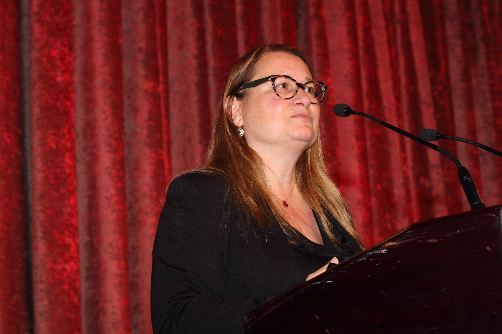
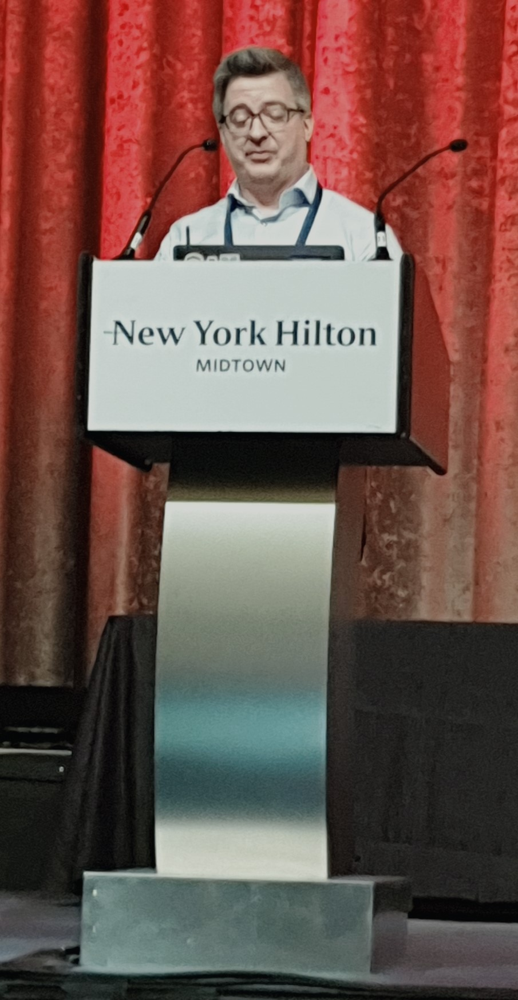
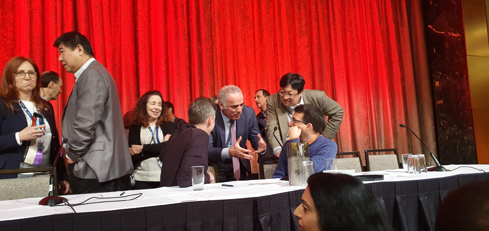

- AAAI 2020 in New York
- 조선일보 [청년 미래탐험대 100] 프로젝트의 도움으로 2월 7일 ~ 2월 13일까지 뉴욕에 다녀올 수 있었다.  
  8일부터 11일까지는 컨퍼런스 취재를 하였는데 그때 무엇을 보고 왔는지 적어보갔슴둥

## About AAAI 2020
- AAAI는 세계에서 가장 권위있는 AI 학회로 이번이 34번째 컨퍼런스다.  
- 자세한 건 구글링~>_<

# Feb 8
### Lectures and Posters

- Teaching Undergraduate A.I Classes: An experiment with an attendance requirement  
- Teaching Constraint Programming using Fable-based Learning via massive Online courses: An experience Report  
- An Experimental Ethics Approach to Robot Ethics Education  
- Making High-Performance Robots Safe and Easy to Use for an Introduction to Computing  
- Teaching Game AI as an Undergraduate Course in Computational Media  
- Predicting and preventing deaths in the ICU: Designing and Analyzing an AI system  
- Gesture Recognition using CNN   
- Wasserstein GAN - Depth First Learning  

## Impressions
- 제일 인상깊었던 강의는 첫 번째 들었던 An Experimental Ethics Approach to Robot Ethics Education. 학생들에게 Ethical Reasoning(Knowing what is good and why)과 Ethical action(commitment to doing good)을 갖추기 위한 교육에 대해 말씀하셨다. 3가지 교육목표를 언급하셨는데 1) Normative influence of Technology, 2) Experimental Ethics와 3) Ethical Research Conduct이다. 
- 이를 바탕으로 이 수업에 참여하는 학생들의 Normative influence of Technology, Experimental Ethics, Ethical Research Conduct가 향상될 것이라고 가설을 세웠으나 표본이 너무 적어서 유의미한 결과는 도출하지 못하였다고 하셨다. 그러나 확실하게 얻었던 점에 대해서는 다음과 같이 말씀하셨다.  
[The one thing that we did find is that there was a diffrence in how well students are called the means, things that we are trying to teach that is the potential formative influence of technology. If they were in that experiment, the participants that students who were repeatedly deeper in experimental participants.]

- 이 외에도 EAAI 세션에서는 교수님들께서 학생들에게 실질적인 machine learning이랑 deep learning을 어떻게 가르칠 것인지, 자기가 직접 해봤던 수업방식과 그 결과에 대해서 공유하고 서로 피드백해주는 방향으로 진행되었음.

- 번외로 Lisa Zhang 교수님께도 질문을 했었음!
  1) Q. Activation function으로 요즘에 sigmoid를 쓰나요?
    - A. Deep learning에서 activation function으로 ReLU와 Batnormalization을 주로 사용하는데 그럼 요즘에는 Sigmoid와 같은 activation function을 안 쓰냐고 물어봤는데 안 쓴다고 대답해주심. 예측값의 확률을 계산할 때 Layer의 마지막에 sigmoid를 놓기는 하지만 layer 중간에는 sigmoid는 요즘 안 쓴다고 하심.
  2) Q. whether graduate studies is a compulsory requirement in working as a specialist in this area? 
    - A. 당연하다고 하셨음 :) Marketing 등에서의 data science 등에서는 학사 수준의 배움으로 소화할 수 있겠지만(skill set을 보유한다면) deep learning에서의 Vision, GAN에서의 research로 들어간다면 석사 이상이 필요할 것이라고 하셨습니다.

- 통로 곳곳에 재밌는 논문 포스터도 있었음. 효과적인 자막삽입 및 동영상 요약을 위한 목소리와 화자를 매칭시키는 알고리즘, 딥러닝이 스스로 게임을 하게 하는 (NCsoft의 blade&soul 1:1 대전) 알고리즘, 얼굴인식 알고리즘에 자신의 얼굴이 포함되었을 때의 이점에 대한 논문, Wikipedia 본문을 읽고 본문 내용에 해당하는 다양한 질문들을 생성하는 인공지능 등등

# Feb 9
### Lectures and Posters

- Presidential address by Yolanda Gil
- How ML is improving U.S Navy Customer Support
- Feedback-Based Self-Learning in large-scale Conversational AI Agents 
- Online Evaluation of Audiences for Targeted Advertising via Bandit 
- Discovery News: A Generic Framework for Financial News Recommend
- Improving Lives of Indebted Farmers Using Deep Learning Predicting Agricultural Produce Prices Using CNN
- Using Small Business Banking Data for Explainable Credit Risk Scoring
- Defecting Suspicious Timber Trades 
- Clarity: Data-Driven Automatic Assessment of Product Competitiveness

### Enterprise booth I visited
- Superb AI Suite 
- Amazon   
- nl matics    
- THETAKEAI & LG    
- Tongdun     
- Baidu
- Google   
- Sony     
- Bloomberg AI

## Impressions
> Presidential address by Yolanda Gil
  - 과연 AI가 과학논문을 작성할 수 있을 것인가?라는 오픈 질문으로 강의를 하셨다. 2040년에는 AI가 논문의 공동저자로 이름을 올릴 수 있을 정도로 발전할 것이라고 주장하셨다. 그 이유로는 AI는 visionary, broad, inclusive, interdisciplinary, determined하면서 동시에 굉장히 systematic하고 error와 bias가 없기 때문이다. 과학자들이 better paper를 쓸수록 AI가 이를 바탕으로 학습이 가능해질 것이고 다양한 영역의 data를 join함으로서 새로운 발견을 이어나갈 것이라고 전망하셨다. Yolanda Gil은 2030년에는 AI가 article을 쓸 수 있을 것이고, 2035년에는 research assistant로 도약하고, 2040년에는 공동저자 수준으로 발전할 것이라고 말했다. 가장 강조하셨던 점은 systematic approach였습니다. 다양한 분야의 데이터를 AI가 학습할 수 있게 준비하면 이를 바탕으로 새로운 연구결과 및 새로운 발견을 해낼 수 있다는 것이었다.  
  - **AI가 인간을 엄청 systematic하고 체계적으로 만들어줄 것이라는 말이 너무 공감되었음**. 소인도 그러합니다.
  
> Bloomberg

- Bloomberg는 실시간으로 전세계에서 쏟아지는 뉴스들을 번역해서 분석해서 사용자에게 제공해줬다. 모니터에 아랍어, 중국어, 일본어 등이 계속 나오는 것을 보고서 이게 무엇이냐고 물어보니 인공지능이 전세계에서 나오는 기사를 수집하고 있는 것이라고 하셨다.
- 이를 바탕으로 인공지능이 기사를 번역한 뒤 간단한 summary를 만들고 Keyword를 도출해냈습니다. 기사가 어떤 회사에 관련되어 있는지, 뉘앙스가 부정적인지 긍정적인지, 인기가 어느 정도 많은지 등을 보여줬다. 나아가 사용자가 질문을 입력하면("starbucks와 LK 커피를 비교해줘") 인공지능이 해당 기업과 질문에 관한 정보들을 뽑아 이를 바탕으로 회사의 전망을 예측해줬다. 
- Bloomberg의 이 인공지능은 고객에게 **독립적이고 편향되지 않은 정보**를 제공하여 **올바른 의사결정**을 돕고 있었다.

> IBM: clarity

- IBM에서는 제품의 경쟁력을 판단해주는 인공지능을 개발해 사용하고 있었다. 인공지능이 해당 제품시장의 선두주자가 누군지, 경쟁력이 무엇인지, 그들의 성공 비결이 무엇인지 분석을 해줬다. 고객 리뷰, 블로그 글, 애널리틱스의 보고서와 뉴스들의 정보를 바탕으로 인공지능이 해당 제품에 대한 긍정, 부정 평가들을 집계한 뒤 해당제품이 시장에서 차지하는 위치, 경쟁우위 등을 실시간으로 보여주었다.
- 어느 정도의 전문 수준이 요구되었던 단순반복 업무도 AI가 다 대체하고 있었음.

> 가장 인상 깊었던 강의: Improving Lives of Indebted Farmers Using Deep Learning Predicting Agricultural Produce Prices Using CNN
- 전반적인 강의의 흐름과는 별개로 제일 인상 깊었습니다. 
- 인도 출신 학자였는데 인도 농부들의 자살을 줄이고자 농부들에게 어떤 농작물을 심어야 할지, 언제 농산물을 팔지 알려주는 인공지능을 만드셨다. 보통 농부들은 '20년째 마을에서 벼를 심었기 때문에 벼를 심는다.' 등 경험적이고 과거 사실에 기반하여 농사를 짓고 있다. 대부분이 다 땅도 없고, 돈도 없기 때문에 대출을 받아서 농사를 하는데 헐값에 농산물을 파는 경우가 대부분이다. 그렇기에 하루에 50명이 넘는 농부들이 자살을 하고 있다는데 이를 해결하고자 하는 프로젝트였다.
- 프로젝트의 의미, 발표자의 발표스킬, 알고리즘 등등 많은 면에서 가장 인상깊었다.

# Feb 10
### Lectures and Posters
- IAAI 2020 Invited Talk: David Cox, MIT-Watson AI Lab (scripts)
- Linguistic Fingerprints of Internet Censorship The Case of Sina Weibo

## Impressions
> IAAI 2020 Invited Talk: David Cox, MIT-Watson AI Lab (scripts)

  - **모든 학회 일정 중에서 제일 인상깊었음**. 
  - 딥러닝의 발전을 얘기해주시면서 딥러닝의 한계도 얘기하셨음. 사진의 몇 개 pixel만 바꿔도 사물을 인식하지 못하는 경우, 사람이 특수 티셔츠를 입으면 detection을 피해갈 수 있거나, 복잡한 질문에는 답을 못하는 등등의 얘기. 그것을 극복할 수 있는 새로운 *Neuro-Symbolic AI*에 대해서 발표하셨음.
  - 실제로 IBM-Watson AI 연구소에서 개발중인데 혁명적이었던 것은 두 가지였음. 1) 데이터를 기존 모델의 1~10%만 쓴다. 2) 인간의 논리를 따라할 수 있다. 이 2개가 가능하면서 동시에 더 높은 성능을 보이는 모델이었음. 논리를 따라할 수 있었기 때문에 '공장 A가 공장 B보다 생산력이 높은 이유는?', '방금 금속원형기둥이 없었다면 어떤 결과가 나왔을까?', '방금 일어난 해킹의 원인이 뭔가요?' 등과 같은 질문을 답할 수 있다고 했다. 기존 방식이면 해킹을 수십만번 당해야 답을 줄 수 있었지만 Neuro-Symbolic AI는 훨씬 적은 데이터로도 정답을 줄 수가 있었다.
  - 강의가 끝나고도 주변에 있는 사람들도 모두 흥미로워했고 Cox 교수님께 질문도 엄청 많이 했다. 약간 앞으로의 인공지능이 어떻게 발전할지에 대해 볼 수 있어서 정말 Sensational했던 강의였다.

# Feb 11
### Lectures and Posters
- Learning Optimal Decision Trees Using Caching Branch-and-Bound Search
- Estimating the Value of Data for Counterfactual Inference and Personalization
- Efficient inference of Optimal Decision Trees
- AI History Panl Adancing AI by Playing Games
- AAAI-20 Invited Talk: The Economic Value of Data for Targeted Pricing
- An Automatic Shoplifting Detection from Surveillance Videos
- Attractive or Faithful Popularity-Reinforced Learning for Inspired Headline Generation
- Being Optimistic to Be Conservative Quickly Learning a CVaR Policy
- Can We Predict the Election Outcome from Sampled Votes
- Efficient Automatic CASH via Rising Bandits
- Enhancing Personalized Trip Recommendation with Attractive Routes
- Explore our suite of matching algorithms
- Getting Closer to AI Complete Question Answering a Set of Prerequisite Real Tasks
- IBM Clarity
- Keywords-Guided Abstractive Sentence Summarization
- Relative Attributing Propagation Interpreting the Comparative Contributions of Individual Units in Deep Nearual Networks
- Sentiment classification in Customer Service Dialogue with Topic-aware Multi-task Learning
- Symmetrical Synthesis for Deep Metric Learning

## Impressions
> AI History Panl Adancing AI by Playing Games

  - 체스 그랜드마스터 Gary Kasparov와 딥마인드, IBM, Sony에서 온 Panel들의 대화가 이 날 가장 인상깊었다. Gary Kasparov의 [Deep Thinknig]도 흥미로웠는데 강연에서도 책과 비슷한 맥락으로 '인공지능은 축복'이다라는 것을 강조했다. 카스파로브는 AI가 우리의 경쟁의 상대가 아니라고 했다. AI를 이길 수가 없기 때문에 AI는 협력의 대상이라 했다. 그러면서 Bloomberg terminal에서 봤던 것처럼 AI를 인간이 더 나은 의사결정을 하기 위한 도구로 쓰자는 것이었다. AI에게 업무를 넘기면서 많은 사람들이 단순노동에서 해방되고 남는 인력과 시간을 신기술을 더 생산적으로 활용하는 선순환으로 이어가자는 말은 굉장히 나에게 와닿았다. 마무리로 카스파로브가 "I라는 위대한 망원경으로 땅을 보지 말고 하늘을 쳐다보자."는 말은 기가 막혔다.
  
## Overall Impression
 - [청년미래탐험대100]이라는 프로젝트의 일환으로 이렇게 좋은 기회를 얻을 수 있었다. 정말 많은 우여곡절 끝에 뉴욕으로 가게 되었는데 나한테는 정말 소중소중귀중귀중한 자리였다. 솔직히 시차 적응도 안 되고 음식도 안 맞고 피곤도 쌓여서 취재만으로도 벅찼을텐데 취재가 끝나면 따로 강연을 들으러 가고, 논문을 살펴보고 저자와 같이 얘기도 나누는 등 유익한 시간을 보냈다. Gil 학회장님의 연설이 끝났을 때도 따라가서 말을 걸었는데 명함도 받고 교수님 소개도 받고 정말 굳굳 기모리
 - 아마 석사를 밟을 것 같다. 학사 수준에서는 기존 알고리즘을 활용하는 수준인 것 같고, 특정 문제를 해결하게 특화된 알고리즘을 만들기 위해서는 석, 박사 이상의 수학이 필요할 것 같다. 이 컨퍼런스 오기 전까지는 석사를 망설였었다. AI도 4~5년 뒤에 꺼지고 마는 거품은 아닐까하는 염려때문이었다. 근데 컨퍼런스에서 Cox 교수님의 강의나 여러 발표들을 들으면서 AI는 아직도 무궁무진하다는 생각과 학사는 티클이구나라는 생각이 들었다. 남은 학기 더 열심히 공부하고 AI와 관련된 이론을 갖추는 시간으로 활용한 뒤에 석사를 밟을 생각이다.
  
 [기사링크](http://news.chosun.com/site/data/html_dir/2020/02/25/2020022504235.html)
  
 **도움을 주신 모든 분들께 감사합니다!!!**
